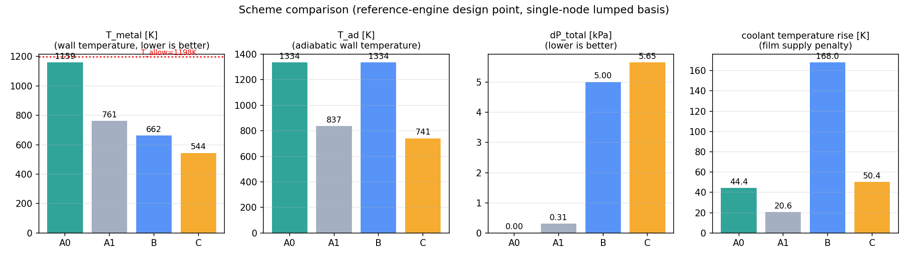
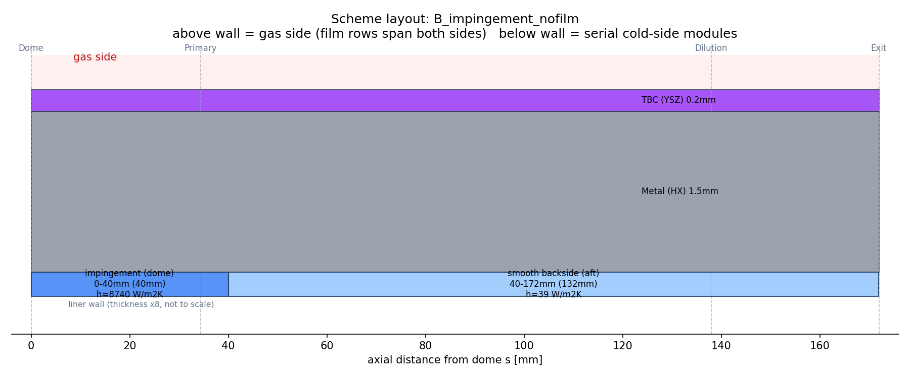
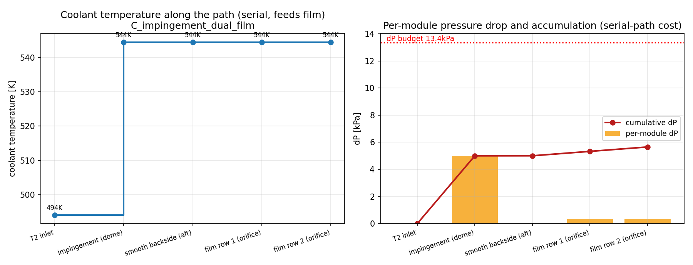

# cooling_stack — Modular Cooling-Stack Design Tool for Small Gas-Turbine Combustor Liners

[](https://github.com/yybelinda/cooling_stack/actions/workflows/ci.yml)
[](LICENSE)


A serial-path, single-node cooling-stack model for sizing the liner
cooling system of small gas-turbine combustors. You compose a cooling
scheme from independent modules (smooth backside convection, ribbed
channel, impingement jets, film rows), and the tool closes the energy
balance on the liner wall — including coolant heat-up along the path,
a pressure-drop budget, and an automatic advice layer that tells you
where the design stands and which lever is worth pulling next.

The tool **reports suggestions; it never changes your parameters
automatically** — parameter changes remain a human decision. All
advice thresholds are explicit in one function and can be edited.

## Model overview

- **Serial-path topology**: coolant flows through the scheme's module
  list in order, absorbing heat and accumulating ΔP segment by segment.
  The path-end coolant state feeds the film rows (film supply
  temperature `T_c_film`).
- **Two module kinds**: `kind='cold'` (backside convection / ribbed
  channel / impingement — change h and absorb heat) and `kind='film'`
  (hot-side film row — changes the driving temperature `T_ad`).
  Wall layers (TBC / metal) are pure thermal resistances handled by the
  solver. Modules are zero-coupled: add, remove, or reorder freely.
- **Solver**: bisection on the single unknown `Tw_cold` (cold-side wall
  temperature) with second-law clamping (no module outlet may exceed
  its supply temperature). Bisection is used deliberately: with serial
  coolant heating, fixed-point schemes stop contracting at high NTU
  (impingement NTU ≈ 3.8) and diverge.
- **Single-node, design-point, lumped** (evaluation station defaults to
  the hottest station). Station-resolved axial extension is a known
  future item — see [Limitations](#limitations).

## Schemes and layout

Four built-in schemes at the reference-engine cruise design point
(provenance below):

| Scheme | Configuration | T_metal [K] | T_ad [K] | ΔP [kPa] | Coolant rise [K] |
|---|---|---:|---:|---:|---:|
| A0 | smooth backside only, film declared but disabled | **1158.7** | 1334.0 | 0.00 | 44.4 |
| A1 | full-length ribbed channel + 1 film row (cross-check) | **760.9** | 837.1 | 0.31 | 20.6 |
| B | impingement (dome) + smooth aft + 1 film row | **662.1** | 740.9 | 5.00 | 168.0 |
| C | B + second film row | **544.5** | 740.9 | 5.65 | 50.4 |



Axial layout of scheme B — colored blocks above/below the wall show the
axial coverage of each method; wall layers drawn x8 (not to scale):



Coolant temperature rise and per-module ΔP accumulation along the path
(scheme C, two film rows fed by the path end):



## Automatic advice layer

After every solve, a rule-based diagnosis prints `[ADVICE]` lines (and
returns them in `res['advice']` for programmatic use). Thresholds are
explicit in `cooling_solver.diagnose()` — change them there:

| Check | Trigger | Advice |
|---|---|---|
| Wall-temperature margin | `T_metal` vs creep allowable (30 MPa / 1000 h): < 0 K over / < 100 K margin | add cooling or lower T_gas; recheck stress level |
| Cold-side saturation | coolant rise ≥ 0.9 × (T_metal − T2) and ΔT > 50 K | lengthening/strengthening cold-side modules is ineffective; bottleneck = coolant heat capacity → more coolant / film row / lower T_gas |
| ΔP budget | > 100 % of budget / > 80 % | enlarge holes / fewer holes / lower impingement ΔP_j |
| Missing film | η = 0 and margin < 150 K | try enabling a FilmRow (set span > 0) |
| Film ineffectiveness | film supply temperature > 0.8 × T_gas | add coolant or shorten upstream absorption length |

Worked example of the saturation rule: in scheme B, doubling the
impingement jet length (40 → 80 mm) leaves `T_metal` unchanged at
662.1 K — the cold side is saturated and the real levers are coolant
mass flow or film supply.

## Module switch rule

**span = 0 (or span < MIN_SPAN, default 1 mm) = the module does not
exist.** One semantics for all module types; disabled modules are
listed as `[SWITCH] ... disabled` in the console output. Declaring a
film row with span 0 keeps it visible in the scheme definition as a
reminder.

## Installation

```bash
git clone https://github.com/yybelinda/cooling_stack
cd cooling_stack
pip install -r requirements.txt
python cooling_main.py        # full run: 4 schemes + figures
pytest tests/ -v              # regression suite (14 tests)
```

No compiled dependencies beyond numpy and matplotlib. Figures are
written next to the script (runtime outputs; committed screenshots
live in `docs/figures/`).

### Library use

```python
from cooling_solver import solve_scheme, diagnose
from cooling_params import build_bc, scheme_B

bc = build_bc()
res = solve_scheme(scheme_B(), bc, verbose=True)
advice = diagnose(res, bc)            # list of suggestion strings
print(res['T_metal'], res['dP_total'])
```

### Custom scheme

```python
# in cooling_params.py
def scheme_D():
    from cooling_modules import ImpingementJet, BacksideConvection, FilmRow
    return [
        ImpingementJet('impingement (dome)', 0.0, 0.040, L_j=0.050),
        BacksideConvection('smooth backside (aft)', 0.040, L_TOTAL),
        FilmRow('film row 1', 0.0244, 0.030, d=2e-3, n_rows=12, n_per_row=20),
    ]

SCHEMES.append(('D_custom', scheme_D))
```

Module list order = coolant flow order. Composition rules (what to
stack, what never to stack) are documented at the top of
`cooling_modules.py`.

### Three worked examples

1. **Baseline, no ribs, no film (A0).** 1158.7 K — only 39 K below the
   1198 K creep allowable of Hastelloy X (30 MPa / 1000 h). This number
   is the quantitative case for impingement or film cooling at this
   T_gas level.
2. **Enable one film row in A0.** Set the FilmRow span (0.0244–0.030 m):
   T_metal 1158.7 → 760.9 K for **0.31 kPa** — the cheapest ΔP in the
   whole menu, and the anchor for the advice layer's film suggestion.
3. **Read the saturation rule.** Scheme B: raise impingement length
   40 → 80 mm; nothing changes (662.1 K). The advice layer names the
   bottleneck (coolant heat capacity) instead of letting you chase a
   dead lever.

## Validation

Scheme A1 is a deliberate cross-check configuration: it reproduces an
independent multi-station reference calculation of the same wall stack
(ribbed channel + film, frozen coolant temperature) at 750 K. The
single-node model gives 760.9 K; the +10.9 K difference is dominated by
the coolant temperature rise (+20.6 K), which the reference model
freezes at T2 — a convention difference, not an error. The regression
suite pins these anchors (±1 K) plus energy residuals (<2 %), the
A1 pressure drop, advice-layer triggers, and four boundary cases
(all-cold-disabled raises, span filtering, zone overlap detection).

## Provenance and related repositories

The default design point corresponds to the reference engine published
in the companion technical note
([DOI: 10.5281/zenodo.22784135](https://doi.org/10.5281/zenodo.22784135)),
which documents the parent 1D combustor design method and its design
point boundary values. `cooling_stack` is a standalone cooling-module;
it shares the gas-property formulations and the material data with the
parent suite released as
[microgt-combustor-1d](https://github.com/yybelinda/microgt-combustor-1d),
and is developed as a modified/extended version of that codebase.

## Limitations

1. Single-node, design-point, lumped model; station-resolved axial
   extension is future work (the span mechanism is already in place).
2. The impingement correlation (Nu = 0.72·Re^0.75·(H/d)^−0.1) is on the
   optimistic side and awaits test calibration; the default H/d = 3.6
   lies below the correlation's stated validity range (set by the small
   annulus width).
3. Film blowing ratio M is reported on two bases (annulus and jet);
   the primary basis awaits 3D geometry freeze.
4. Multiple film rows share one full-flow m_film (η superposition
   basis); per-row splitting is not yet modeled.
5. Cold-side saturation (NTU ≫ 1) makes cold-side modules insensitive —
   this is physics, not a bug; re-evaluate per station once the axial
   extension exists.

## License

Code: [MIT](LICENSE). Documentation and figures: additionally CC BY 4.0.

## Citation

See [CITATION.cff](CITATION.cff) or cite as:

> Yang, Y. (2026). *cooling_stack: a modular 1D cooling-stack design
> tool for small gas-turbine combustor liners* (v1.2.0). GitHub.
> https://github.com/yybelinda/cooling_stack

Author: Yang Yang — [github.com/yybelinda](https://github.com/yybelinda)
(yybelinda@gmail.com / yybelinda0000@163.com)
